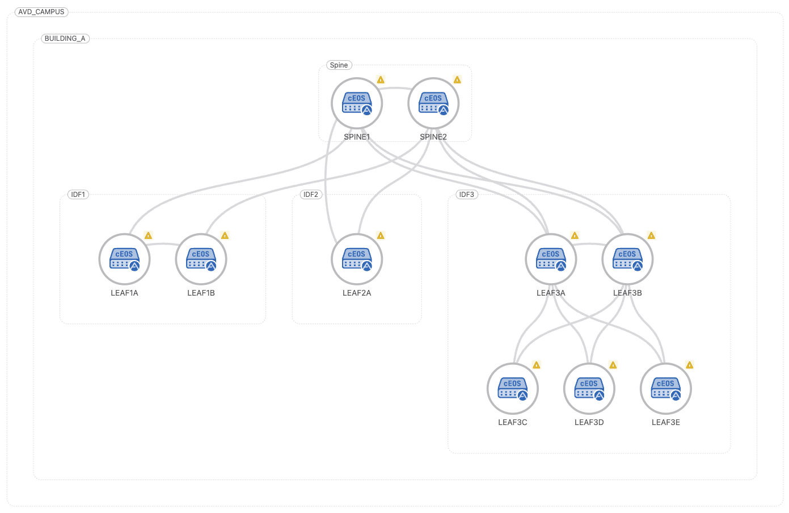
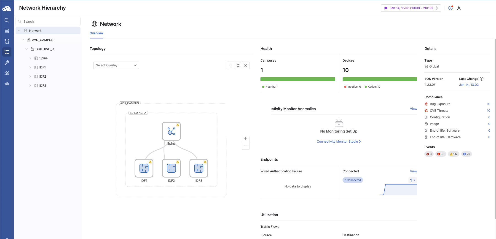
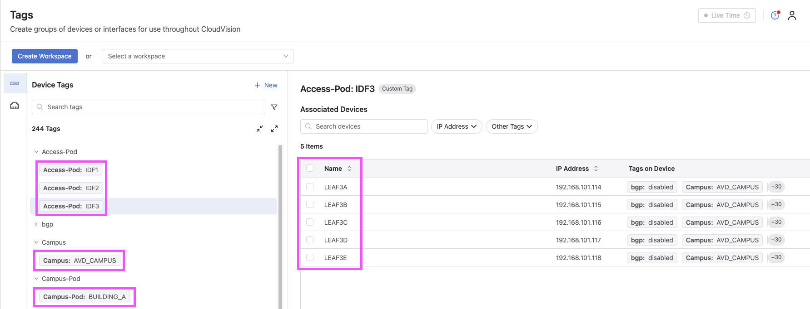
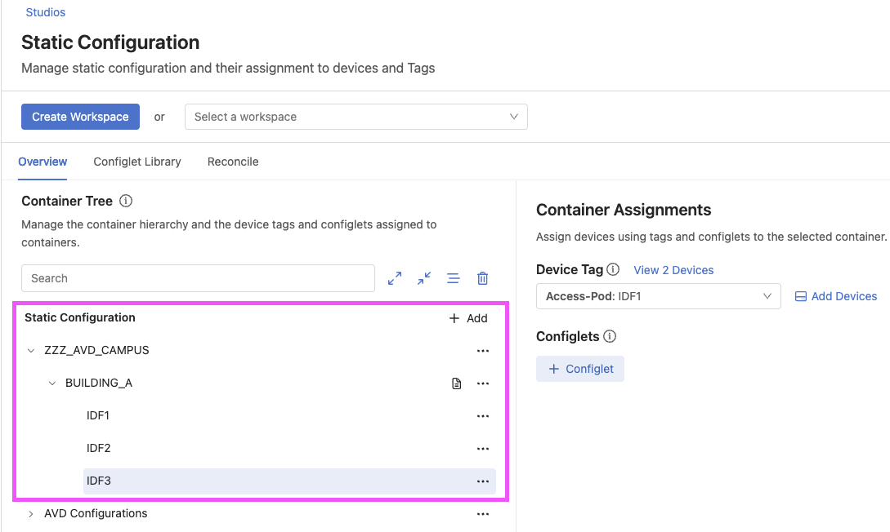
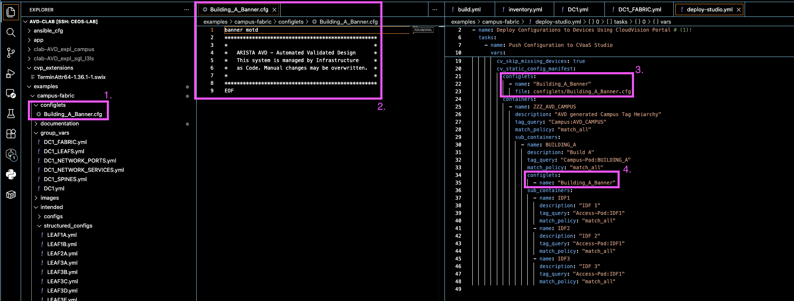
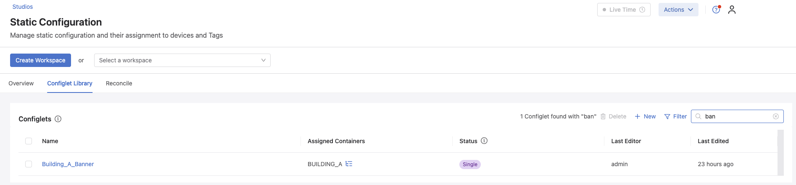
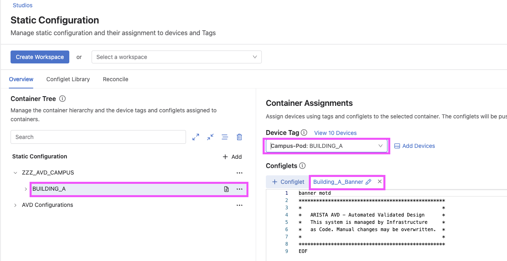
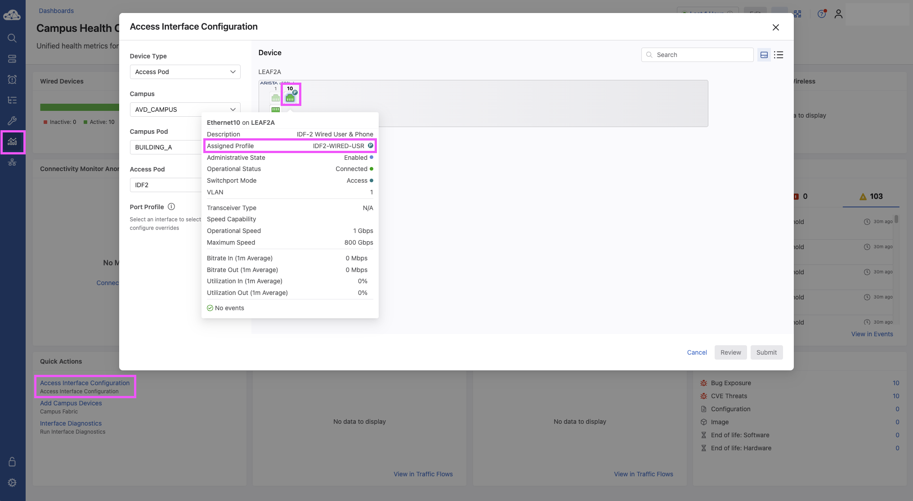
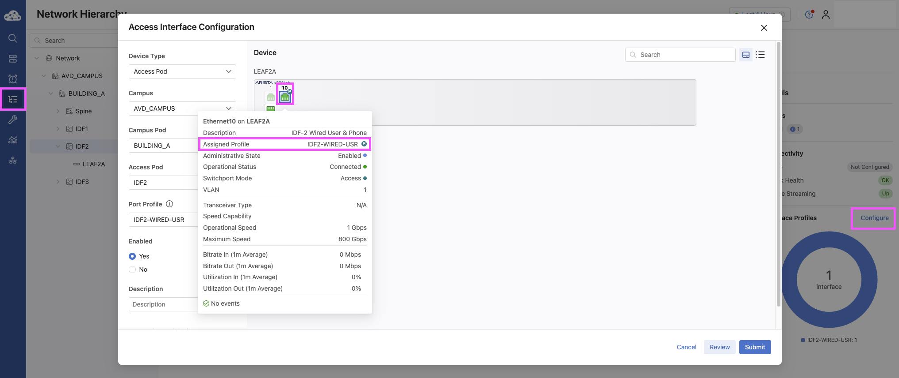
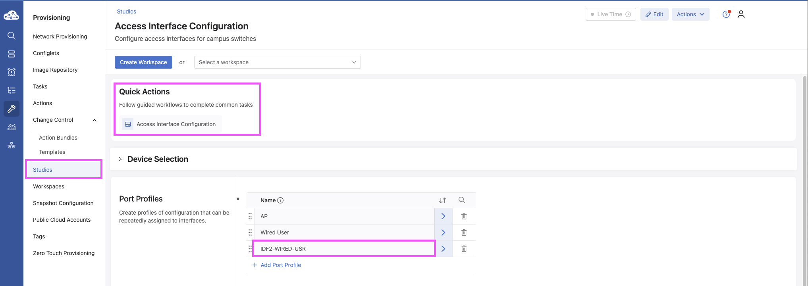

# Using AVD-Generated CloudVision Campus Tags with Static Studios

> **Audience:** Campus Network Operators & Automation Engineers  
> **Scope:** Day-1 (AVD) + Day-2 (CloudVision Operations)  
> **Validated on:** CVaaS / CloudVision 2024.3+

> **TL;DR**  
> This repository documents a practical Campus workflow where **AVD-generated CloudVision Campus tags** act as the integration point between **Day-1 automation** and **Day-2 operations**.  
>
> AVD builds and maintains the campus fabric, while CloudVision consumes those tags to drive **Campus topology, Network Hierarchy, Static Studios, and Quick Actions**, enabling operators to safely manage port profiles and operational changes through the UI without breaking automation intent.

When deploying Campus fabrics with Arista AVD, a common challenge is determining how to cleanly integrate...


This repository documents a real-world, customer-inspired workflow that uses **AVD-generated CloudVision Campus tags** as the contract between these two domains.

By generating and applying Campus tags directly from AVD, CloudVision can:

- Render accurate Campus topology views
- Dynamically place devices into Studio container hierarchies
- Enable clean configlet inheritance without device-level assignments
- Support a hybrid operational model where AVD and Studios coexist

In this model:

- **AVD** is responsible for building and maintaining the Campus fabric and infrastructure
- **CloudVision Studios** are leveraged for topology visualization, container-based configuration, and ongoing day-2 operations

This guide walks through the architecture, tag generation, Studio container hierarchy, and configlet inheritance model using screenshots from a working lab environment.

---

## High-Level Architecture



Figure 1 – Campus fabric topology generated and tagged by AVD

---

## Overview

The `arista.avd.eos_designs` role can generate **CloudVision Tags** that are applied to devices and interfaces during fabric deployment. These tags are used by CloudVision to:

- Render accurate **Campus Topology views**
- Enable **tag-based searches and filters**
- Dynamically place devices into **Studio container hierarchies**
- Support **hybrid AVD + Studios workflows**

This functionality is supported on:

- **CloudVision as a Service (CVaaS)**
- **On-prem CloudVision 2024.3.0 or later**

---

## Documentation References

- CloudVision Tags (AVD):  
  <https://avd.arista.com/5.7/ansible_collections/arista/avd/roles/eos_designs/docs/how-to/cloudvision-tags.html>

- Static Configuration Studio Deployment:  
  <https://avd.arista.com/5.7/ansible_collections/arista/avd/roles/cv_deploy/index.html#static-configuration-studio-deployment>

- Access Interface Configuration Studio (Quick Actions):  
  <https://www.arista.io/help/articles/provisioning-studios-built-in-access-interface#access-interface-configuration-studio>
  
---

## Enabling CloudVision Tag Generation

To globally enable CloudVision tag generation for Campus fabrics, both of the following settings must be enabled:

```yaml
generate_cv_tags:
  topology_hints: true
  campus_fabric: true
```

These options allow AVD to generate the metadata required for:

- Campus topology rendering
- CloudVision Network Hierarchy UI activation
- Studio-based workflows

---

## CloudVision Network Hierarchy



Figure 2 – CloudVision Network Hierarchy UI activated by Campus tags

---

## Campus Tag Variables

AVD assigns CloudVision tags using fabric variables or node_type_keys.
The following variables are supported for Campus deployments:

| Variable                | Description                                       |
| ----------------------- | ------------------------------------------------- |
| `campus`                | Logical campus name                               |
| `campus_pod`            | Building or campus pod                            |
| `campus_access_pod`     | Access pod / IDF (not assigned to spines)         |
| `cv_tags_topology_type` | Campus node type (`spine`, `leaf`, `member-leaf`) |

---

## Example: Fabric Tag Assignment

L3 Spine Configuration

```yaml
l3spine:
  defaults:
    campus: AVD_CAMPUS
    campus_pod: BUILDING_A
  node_groups:
    - group: SPINES
      cv_tags_topology_type: spine
```

L2 Leaf Configuration

```yaml
l2leaf:
  defaults:
    campus: AVD_CAMPUS
    campus_pod: BUILDING_A
  node_groups:
    - group: IDF1
      cv_tags_topology_type: leaf
      campus_access_pod: IDF1
    - group: IDF2
      cv_tags_topology_type: leaf
      campus_access_pod: IDF2
    - group: IDF3
      cv_tags_topology_type: leaf
      campus_access_pod: IDF3
    - group: IDF3_3C
      cv_tags_topology_type: member-leaf
      campus_access_pod: IDF3
```

---

## CloudVision Tags Applied to Devices



Figure 3 – CloudVision device view showing AVD-generated Campus tags

---

## Static Configuration Studio Using a Config Manifest

A Static Configuration Studio can consume the CloudVision tags generated by AVD using a cv_static_config_manifest.

The manifest:

- Reads tags applied by arista.avd.eos_designs
- Uses tag_query expressions to dynamically place devices
- Builds a container hierarchy based on Campus structure
- Applies configlets to containers and inherited devices

---

## Example Static Config Manifest

```yaml
cv_static_config_manifest:
  configlets:
    - name: Building_A_Banner
      file: configlets/Building_A_Banner.cfg

  containers:
    - name: ZZZ_AVD_CAMPUS
      description: AVD generated Campus Tag Hierarchy
      tag_query: "Campus:AVD_CAMPUS"
      match_policy: match_all

      sub_containers:
        - name: BUILDING_A
          description: Building A
          tag_query: "Campus-Pod:BUILDING_A"
          match_policy: match_all
          configlets:
            - name: Building_A_Banner

          sub_containers:
            - name: IDF1
              description: IDF 1
              tag_query: "Access-Pod:IDF1"
              match_policy: match_all
            - name: IDF2
              description: IDF 2
              tag_query: "Access-Pod:IDF2"
              match_policy: match_all
            - name: IDF3
              description: IDF 3
              tag_query: "Access-Pod:IDF3"
              match_policy: match_all
```

---

## Static Studio Container Hierarchy



Figure 4 – Static Configuration Studio containers built from tag queries

---

## Deploying the Manifest with `cv_deploy`

```yaml
tasks:
  - name: Deploy CloudVision configuration
    ansible.builtin.import_role:
      name: arista.avd.cv_deploy
    vars:
      ## Deploy full hierarchy of containers and configlets into CloudVision “Static Configuration Studio”
      cv_static_config_manifest:
        configlets:
          - name: "Building_A_Banner"
            file: configlets/Building_A_Banner.cfg
        containers:
          - name: ZZZ_AVD_CAMPUS
              description: "AVD generated Campus Tag Heiarchy"
              tag_query: "Campus:AVD_CAMPUS"
              match_policy: "match_all"
              sub_containers:
              - name: BUILDING_A
                  description: "Build A"
                  tag_query: "Campus-Pod:BUILDING_A"
                  match_policy: "match_all"
                  configlets:
                  - name: "Building_A_Banner"
                  sub_containers:
                  - name: IDF1
                      description: "IDF 1"
                      tag_query: "Access-Pod:IDF1"
                      match_policy: "match_all"
                  - name: IDF2
                      description: "IDF 2"
                      tag_query: "Access-Pod:IDF1"
                      match_policy: "match_all"
                  - name: IDF3
                      description: "IDF 3"
                      tag_query: "Access-Pod:IDF1"
                      match_policy: "match_all"
```

AVD performs the following actions:

- Uploads configlets into the Configlet Library
- Creates the Studio container hierarchy
- Places devices based on tag queries
- Applies configlets to all matching devices

---

## Root Container Ordering Behavior

When deploying or adding new root containers, the `cv_deploy` role places all AVD-managed root containers at the top of the Studio container tree.

**Note**
This automated behavior may reorder containers that were manually arranged in the UI.

---

## Configlet Inheritance Example

This section illustrates how **AVD manages configlets** and how those configlets are inherited by devices through a **Static Configuration Studio container hierarchy**.

The workflow is as follows:

1. AVD references a raw `.cfg` configlet file from the repository.
2. The configlet is declared in the `configlets` section of the Static Studio manifest.
3. The configlet is associated with the appropriate container in the manifest hierarchy.
4. CloudVision applies the configlet to all devices that match the container’s tag query.

---

### AVD Configlet Declaration in the Manifest



AVD references the raw configuration file and includes it in the manifest so it can be managed by CloudVision.

---

### Configlet Deployed to the CloudVision Library



During the `cv_deploy` phase, AVD uploads the configlet into the CloudVision Configlet Library.

---

### Configlet Associated with the Studio Container



The configlet is attached to a Static Studio container.  
All devices assigned to this container automatically inherit the configlet.

---

## Summary

By combining:

- AVD-generated CloudVision Campus tags
- Static Studio manifests
- Tag-based container placement

You gain a scalable, deterministic, and supportable integration between AVD and CloudVision Studios, while maintaining clear ownership boundaries between build-time automation and day-2 operations.

## Day-2 Operations (CloudVision Campus)

This section focuses on **Day-2 operational workflows** using the **CloudVision Campus UI**, with emphasis on how network operators interact with the platform *after* Day-1 provisioning has been completed by AVD.

Unlike Day-1 automation, where AVD is the source of truth, Day-2 operations leverage **CloudVision Studios, Network Hierarchy, and Quick Actions** to safely make operational changes at scale.

- Access Interface Configuration Studio (Quick Actions):  
  <https://www.arista.io/help/articles/provisioning-studios-built-in-access-interface#access-interface-configuration-studio>

---

### Entry Point: Campus Health Overview

For network operators assigned a **Campus profile**, the default landing page after logging into CloudVision is the **Campus Health Overview** dashboard.

This dashboard provides:

- High-level campus health status
- Visibility into wired and wireless domains
- Direct navigation into Campus-specific operational workflows

<!-- Image: Campus Health Overview Dashboard -->



From this view, operators can quickly pivot from monitoring to action without navigating away from the Campus workflow context.

---

### Navigating the Network Hierarchy

From the **Campus Health Overview**, operators can navigate to the **Network Hierarchy UI**, which represents the logical campus structure built using **AVD-generated CloudVision Campus tags and containers**.

The Network Hierarchy enables operators to:

- View sites, buildings, floors, and other logical groupings
- Understand configuration and policy inheritance scopes
- Target operational changes with precision and confidence

Quick Actions menus are accessible **per container**, directly reflecting the underlying **tag-based hierarchy** created during Day-1 deployment.

Within the Quick Actions workflow, the UI presents a **front-panel view of the switch**, allowing operators to **single-select or multi-select switchports** and assign them to predefined port profiles.



Because configuration and policies are associated at the container level, hierarchy placement directly determines what devices inherit.

---

### Quick Actions: Operational Changes at Scale

Within the Campus workflow, operators can launch **Quick Actions** directly from the Campus dashboards or Network Hierarchy views.

One of the most common Day-2 use cases is **setting or updating switch port profiles**.

Quick Actions allow operators to:

- Select one or more devices or ports
- Apply predefined port profiles
- Execute changes without modifying AVD source files

### Example: Applying Switch Port Profiles

Using Quick Actions, an operator can:

1. Select a container, device, or specific interfaces
2. Choose the appropriate **Switch Port Profile**
3. Review the proposed change
4. Execute the action through CloudVision

This workflow ensures:

- Consistency across the campus
- Reduced operational risk
- Fast response to Day-2 requirements

<!-- Image: Quick Actions Port Profile Selection -->



---

### Key Takeaways for Day-2 Operations

- **AVD remains the Day-1 source of truth**
- **CloudVision enables controlled Day-2 changes**
- Network Hierarchy and tags define operational scope
- Quick Actions provide safe, repeatable workflows for operators

This separation allows infrastructure teams to maintain strong automation discipline while empowering operations teams with the flexibility required for daily campus management.

---

## About This Repository

This repository contains personal lab work and reference material created to explore hybrid AVD and CloudVision Campus workflows.  

It is not official Arista documentation or a supported design guide.
